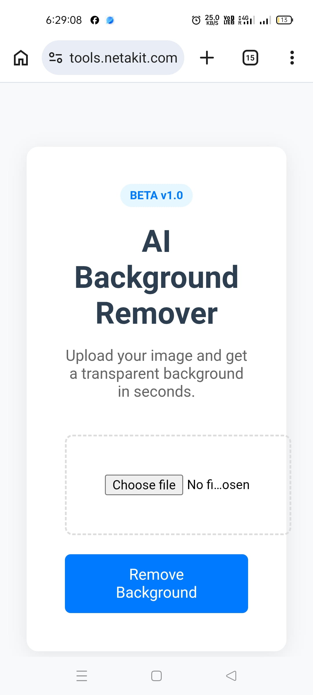
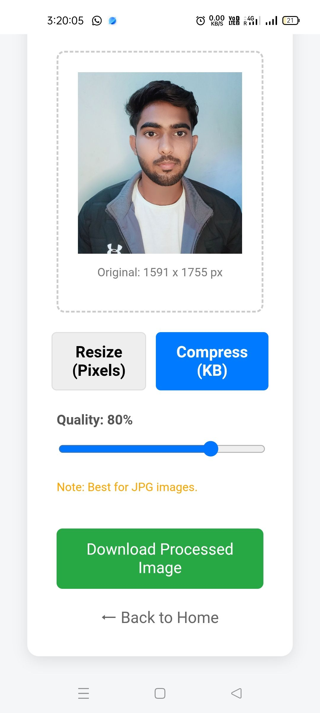

# 🪄 Image Processing SaaS & API (BG Remover + Resizer)

## 🚀 Overview
A production-ready SaaS module providing a suite of image processing tools. It features instant background removal and intelligent image compression/resizing, along with a secure, token-based API for developers.

  
  

---

## 🔑 Key Features
* **AI Background Removal:** High-accuracy background removal using `rembg`.
* **Smart Image Resizer & Compressor:** Aspect-ratio locking and quality control for optimized web images.
* **Admin-Controlled API Keys:** Secure access generation and management.
* **Usage Logging:** Track API requests and processing limits per user.
* **Decoupled Architecture:** Clean separation between the Flask API backend and the frontend UI.

## 🛠 Tech Stack
* **Backend:** Flask, Python
* **Database:** SQLite
* **Image Processing:** Pillow (Resizing/Compression), rembg (AI Engine)
* **Frontend:** HTML, CSS, JavaScript (Vanilla)

---

## 📡 API Documentation

### 1. Background Removal API
`POST /api/remove`

**Headers:**
`X-API-KEY: your_generated_api_key`

**Request Body (Form-Data):**
| Key | Type | Description |
| :--- | :--- | :--- |
| `file` | `image` | The image file to be processed (PNG/JPG) |

### 2. Image Compression API (Internal)
*Handles resizing by pixels or compression by KB threshold using Pillow optimization algorithms.*

---

## 🌍 Live Demo
* **Frontend UI:** [tools.netakit.com](https://tools.netakit.com)

## 🔮 Roadmap / Future Improvements
- [ ] Implement rate limiting (Redis)
- [ ] Add payment gateway integration
- [ ] Advanced analytics dashboard for API usage
- [ ] 
